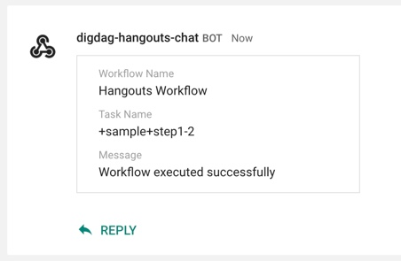
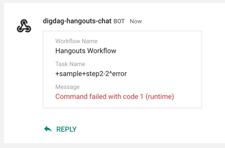

# digdag-hangouts-chat

[](https://jitpack.io/#tamanyan/digdag-hangouts-chat)
[](https://jitpack.io/#tamanyan/digdag-hangouts-chat)

## Description

digdag-hangouts-chat is a plugin sending messages to Hangouts Chat.
It can customize json templates for building messages.

***DEMO:***

|SUCCESS|FAILED|
|---|---|
|[](sample/imgs/success.jpg)|[](sample/imgs/failed.jpg)|

## Features

- Can use the `hangouts>` opetaror
- Easy to use
- Flexible templates

## Requirement

- [Digdag](https://www.digdag.io/)
- Hangouts Chat
  - Webhook URL [(Incoming WebHooks)](https://developers.google.com/hangouts/chat/how-tos/webhooks)

## Usage

Also, you can see expamle workflow at [sample](https://github.com/tamanyan/digdag-hangouts-chat/tree/master/sample) directory.

1. Create workflow file (e.g. hangouts.dig)

```yaml
_export:
  plugin:
    repositories:
      - https://jitpack.io
      # - file://${repos}
    dependencies:
      - com.github.tamanyan:digdag-hangouts-chat:0.1.5
      # - io.digdag.plugin:digdag-hangouts-chat:0.1.5
  # Set Reqired params
  webhook_url: https://chat.googleapis.com/v1/spaces/XXXXXXXXXXXXXXX/messages?key=XXXXXXXXXXXXX
  # Set Option params
  workflow_name: Hangouts Workflow
  ENV: develop

+step1-1:
  echo>: "Next will be success!"

+step1-2:
  hangouts>: success_template.json

+step2-1:
  echo>: "Next will be failed..."

+step2-2:
  sh>: exit 1
  _error:
    hangouts>: failed_template.json
```

2. Create templates for Hangouts Message (e.g. success_template.json)

```json
{
  "cards": [
    {
      "sections": [
        {
          "widgets": [
            {
              "keyValue": {
                "topLabel": "Workflow Name",
                "content": "${workflow_name}",
                "contentMultiline": "false"
              }
            },
            {
              "keyValue": {
                "topLabel": "Task Name",
                "content": "${task_name}"
              }
            },
            {
              "keyValue": {
                "topLabel": "Message",
                "content": "Workflow executed successfully",
                "contentMultiline": "true"
              }
            }
          ]
        }
      ]
    }
  ]
}
```

3. Runs workflow

```console
$ digdag run -a hangouts.dig
```

## Customize Messages

You can see documentations about `Hangout Card formatting Message` if you are interested in customizing messages.

[Card Formatting Messages](https://developers.google.com/hangouts/chat/reference/message-formats/cards)

## Author

[Taketo Yoshida](https://twitter.com/TamaObject12)

## License

[Apache License 2.0](LICENSE)
